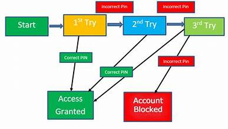

 <html lang="en">
<head>
    <meta charset="UTF-8">
    <meta name="viewport" content="width=device-width, initial-scale=1.0">
    <title>My Web Page</title>
    
</head>
<body>
    <header>
        <h1>Welcome to My Web Page</h1>
    </header>
    

        <h2>STATE TRANSITION TESTING</h2>
        
Hello, I'm a web developer.

        
State Transition Testing is a black box testing technique in which changes made in input conditions cause state changes or output changes in the Application under Test. State transition testing helps to analyze behaviour of an application for different input conditions.

        
   
 State-Transition testing is the one of the black box testing & desing techniques which can be used to derive test cases (or) test for the application functions which go through several states 
        

        <h2> APPLICATION FUNCTIONALITIES & 
            SEVERAL STATES </h2>
            
For example let us look in to net banking software  
                when you visit a site you can see a login details 

 

now you can see the above login page now if you enter the login details and login if the password is wrong it give 2nd time to enter the correct if you enter the correct password you can access the site but if you again enter the wrong password at the 2nd time it gives 3rd chance to enter the correct password in 3rd time if you enter the wrong password the access will be locked and its shows your accoungt is locked

     
    
 WRONG PASSWORD  
        WRONG PASSWORD  
        WRONG PASSWORD  
        ACCOUNT LOCKED 
    

         
        <pr> for the 4th try it will be blocked the access  
            and you can't able to acces the data on that site this is the state transition testing  
        </pr>
         

  
Identify States: Begin by identifying all possible states the system can be in. These states represent different conditions or situations that the system may encounter during its operation 
  
Identify Transitions: Identify the events or inputs that cause the system to transition from one state to another. These transitions could be triggered by user actions, system events, or other external stimul 
Create a State Transition Diagram: A state transition diagram visually represents the states, transitions, and conditions triggering those transitions. It provides a clear overview of the system's behavior. 
Design Test Cases: Based on the state transition diagram, design test cases that cover transitions between states, including both valid and invalid transitions. Each test case should specify the initial state, the input or event triggering the transition, the expected outcome, and the resulting state. 

Execute Test Cases: Execute the designed test cases against the system under test. Monitor the system's behavior as it transitions between states and verify that it behaves as expected according to the defined transitions. Verify Results: Compare the actual behavior of the system with the expected behavior specified in the test cases. Identify any discrepancies or deviations and report them as defects if necessary.
 

State transition testing is particularly useful for systems with complex behaviors, such as user interfaces, embedded systems, and communication protocols. It helps ensure thorough test coverage by systematically exploring the various states and transitions within the system.

</body>
</html>
